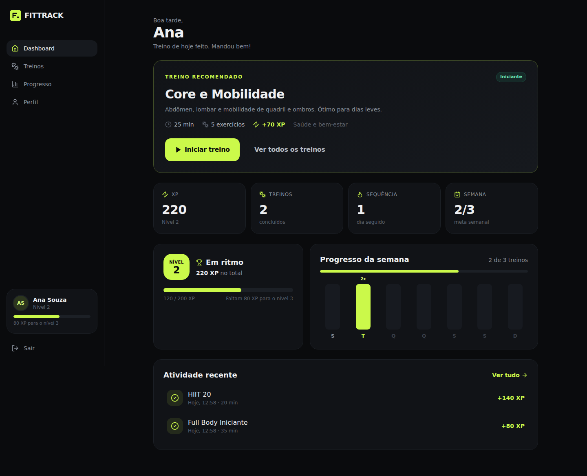
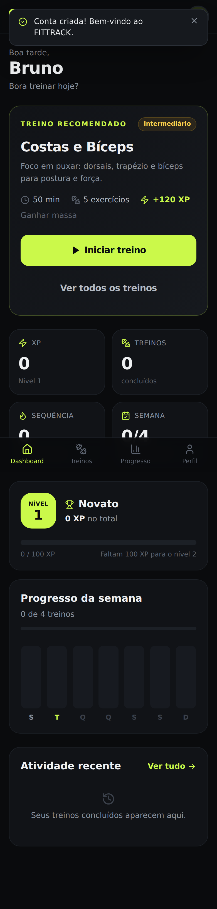
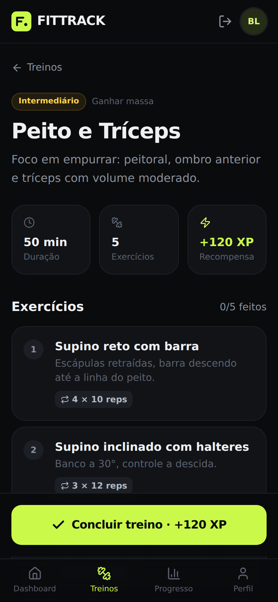
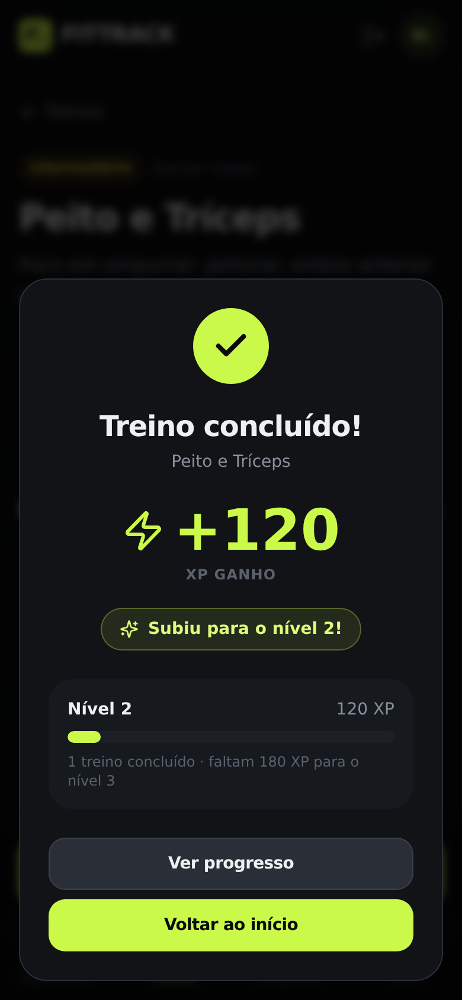

# FITTRACK

Plataforma web de fitness para acompanhar treinos, ganhar XP e visualizar a evolução.
MVP acadêmico: **React + Vite + TypeScript + Tailwind** no frontend, **Supabase** (Auth + PostgreSQL + RLS + Storage) como backend, deploy na **Vercel**.



<p>
  
  
  
</p>

---

## Sumário

1. [Arquitetura](#arquitetura)
2. [Fluxo principal](#fluxo-principal)
3. [Estrutura do projeto](#estrutura-do-projeto)
4. [Banco de dados](#banco-de-dados)
5. [Regras de negócio e segurança](#regras-de-negócio-e-segurança)
6. [Passo a passo: Supabase](#1-criar-o-projeto-no-supabase)
7. [Passo a passo: rodar localmente](#3-configurar-as-variáveis-de-ambiente-local)
8. [Passo a passo: GitHub](#4-criar-o-repositório-no-github)
9. [Passo a passo: Vercel](#5-deploy-na-vercel)
10. [Testar em produção](#7-testar-o-fluxo-em-produção)
11. [Roteiro de apresentação](#roteiro-de-apresentação-3-minutos)
12. [Problemas comuns](#problemas-comuns)
13. [Próximas versões](#próximas-versões)

---

## Arquitetura

```
                 USUÁRIO
                    ↓
              ┌───────────┐
              │  Vercel   │   SPA estática (React/Vite)
              │ React/Vite│   VITE_SUPABASE_URL + VITE_SUPABASE_ANON_KEY
              └─────┬─────┘
                    ↓  HTTPS (supabase-js)
              ┌───────────┐
              │ Supabase  │
              ├───────────┤
              │ Auth      │   cadastro, login, sessão (JWT)
              │ PostgREST │   API REST gerada das tabelas
              │ PostgreSQL│   tabelas + funções (RPC)
              │ RLS       │   cada usuário só vê os próprios dados
              │ Storage   │   fotos de perfil (bucket "avatars")
              └───────────┘
                    ↑
              GitHub (código) → Vercel faz deploy a cada push
```

**Não existe backend Node/Express.** Toda regra sensível (conceder XP, registrar treino) roda **dentro do banco**, em funções `SECURITY DEFINER` chamadas via RPC. O frontend só tem a *anon key*, que é pública por design; quem protege os dados é o RLS.

## Fluxo principal

```
Cadastro (2 etapas) → Dashboard → Treinos → Detalhe do treino → "Concluir treino"
   → RPC complete_training() → +XP, +1 treino, sessão no histórico
   → Modal de confirmação (com level up) → Dashboard/Progresso atualizados
```

## Estrutura do projeto

```
fittrack/
├── src/
│   ├── components/        # UI reutilizável (cards, gráficos, modal, rotas protegidas)
│   │   └── ui/            # Button, Card, Input/Select, estados (loading/erro/vazio)
│   ├── pages/             # Login, Cadastro, Dashboard, Treinos, Detalhe, Progresso, Perfil, 404
│   ├── layouts/           # AppLayout (sidebar desktop + nav inferior mobile), AuthLayout
│   ├── hooks/             # useAuth (sessão), useAppData (perfil+stats), useAsync, useToast
│   ├── lib/               # cliente Supabase, curva de nível, formatação, validação, erros
│   ├── services/          # acesso a dados: auth, profile, training, avatar
│   └── types/             # tipos TypeScript do domínio
├── supabase/
│   ├── migrations/        # SQL versionado (schema, trigger, RLS, funções, storage, seed)
│   ├── setup_all.sql      # todas as migrations em um arquivo (para o SQL Editor)
│   └── tests/             # testes de RLS/regras para Postgres local (não rodar no Supabase)
├── scripts/e2e.mjs        # teste ponta a ponta com Playwright (opcional)
├── docs/screenshots/      # capturas para a apresentação
├── .env.example
├── vercel.json            # rewrite de SPA (rotas como /treinos/:id funcionam no refresh)
└── package.json
```

## Banco de dados

| Tabela | Descrição | Colunas principais |
|---|---|---|
| `profiles` | 1:1 com `auth.users`. **Sem senha.** | `id` (FK auth.users), `name`, `age`, `height` (cm), `weight` (kg), `goal`, `fitness_level`, `avatar_url`, `xp`, `total_workouts`, `created_at`, `updated_at` |
| `training_catalog` | Catálogo de treinos (somente leitura) | `id`, `name`, `description`, `goal`, `difficulty`, `duration_minutes`, `xp_reward`, `created_at` |
| `training_exercises` | Exercícios de cada treino | `id`, `training_id` (FK), `name`, `description`, `sets`, `repetitions`, `duration_seconds`, `order_index` |
| `training_sessions` | Treinos concluídos | `id`, `user_id` (FK profiles), `training_id` (FK), `completed_at`, `xp_earned` |

Coluna extra: `training_catalog.xp_reward` define quanto XP cada treino vale (70 a 160 conforme dificuldade).

**Funções (RPC)**

| Função | O que faz |
|---|---|
| `complete_training(p_training_id)` | Valida usuário e treino, trava o perfil, bloqueia repetição do mesmo treino em 60 s, insere a sessão e soma XP/treinos numa única transação. Retorna XP ganho, novo total, nível e se houve level up. |
| `get_user_stats(p_tz)` | XP, nível, total de treinos, treinos da semana (seg a dom), sequência de dias e se treinou hoje, no fuso do usuário. |
| `level_from_xp(xp)` | Curva de nível: subir do nível N para N+1 custa N × 100 XP (níveis 2, 3, 4, 5 em 100, 300, 600, 1000 XP). |
| `handle_new_user()` (trigger) | Cria o perfil automaticamente a partir dos dados do cadastro, com sanitização. |

**Migrations** (`supabase/migrations/`, todas idempotentes):

1. `…001_schema.sql` tabelas, constraints, índices, `updated_at`
2. `…002_auth_profile_trigger.sql` perfil criado no cadastro
3. `…003_rls_policies.sql` RLS + privilégios por coluna
4. `…004_functions.sql` regras de negócio (RPC)
5. `…005_storage_avatars.sql` bucket e políticas de foto
6. `…006_seed_trainings.sql` 7 treinos e 35 exercícios de demonstração

## Regras de negócio e segurança

| Regra | Como é garantida |
|---|---|
| Só autenticado acessa dashboard/perfil/treinos | `ProtectedRoute` no frontend **e** RLS/grants no banco (anon não lê nem o catálogo) |
| Cada treino concluído gera XP | `complete_training()` usa o `xp_reward` do catálogo (o cliente não informa o valor) |
| Sessão pertence a quem treinou | `user_id` vem de `auth.uid()` dentro da função, nunca do cliente |
| XP e total atualizados após conclusão válida | Mesma transação; linha do perfil travada com `FOR UPDATE` |
| Nível calculado pelo XP | `level_from_xp()` no banco e `levelFromXp()` no front (mesma fórmula) |
| Treino aparece no histórico | Página Progresso e card "Atividade recente" |
| Usuário não vê/altera dados de outro | RLS em `profiles` e `training_sessions` (`auth.uid() = id/user_id`) |
| Sem registros inválidos | Sem permissão de INSERT direto em `training_sessions`; `CHECK` constraints; treino inexistente e cliques duplicados rejeitados |
| Cliente não pode "se dar XP" | Privilégios por coluna: o usuário só pode alterar `name, age, height, weight, goal, fitness_level, avatar_url` |
| Senha nunca no banco da aplicação | Somente Supabase Auth; `profiles` não tem coluna de senha |
| Nenhum secret no código | Apenas `VITE_SUPABASE_URL` e `VITE_SUPABASE_ANON_KEY` (públicas). A `service_role` key **nunca** vai para o frontend |

### Testes realizados

- **Banco (Postgres 16 + mock de Supabase):** 25 verificações de RLS e regras (usuário A não lê/altera B, não consegue alterar XP, não insere sessão direta, anon bloqueado, anti-duplicação, sequência de dias, curva de nível, storage por pasta). Scripts em `supabase/tests/`.
- **Ponta a ponta (Supabase Auth + PostgREST reais + Playwright):** 27 verificações passando: rota protegida, cadastro com validação, dashboard, filtro de treinos, conclusão com +XP, level up, bloqueio de duplicação, histórico, progresso, edição de perfil, persistência de sessão após reload, logout, login inválido, isolamento entre dois usuários, responsividade mobile sem scroll horizontal, 404 e zero erros no console. Script em `scripts/e2e.mjs`.

---

## 1. Criar o projeto no Supabase

1. Acesse <https://supabase.com> → **New project**.
2. Escolha nome (`fittrack`), senha do banco (guarde, não vai no código) e região **South America (São Paulo)**.
3. Aguarde o projeto ficar pronto (1 a 2 min).

**Configurar autenticação** (Authentication → Sign In / Providers → Email):

- Para a **apresentação**, desligue **Confirm email**. Assim o cadastro entra direto no dashboard.
  Se deixar ligado, o app mostra a tela "Confirme seu e-mail" e funciona do mesmo jeito, mas depende do e-mail chegar (o SMTP gratuito do Supabase tem limite baixo de envios por hora).

## 2. Executar as migrations

**Opção A: SQL Editor (mais simples)**

1. Supabase → **SQL Editor** → **New query**.
2. Cole o conteúdo inteiro de [`supabase/setup_all.sql`](supabase/setup_all.sql) e clique **Run**.
3. Confira em **Table Editor**: `training_catalog` com 7 treinos, `training_exercises` com 35 linhas.
4. Em **Storage**, deve existir o bucket `avatars`.

**Opção B: Supabase CLI (versionado)**

```bash
npm i -g supabase
supabase login
supabase link --project-ref SEU_PROJECT_REF   # Project Settings > General > Reference ID
supabase db push                              # aplica supabase/migrations/*
```

## 3. Configurar as variáveis de ambiente (local)

Em Supabase → **Project Settings → API** copie **Project URL** e a chave **anon public** (em projetos novos pode aparecer como *Publishable key*; qualquer uma das duas funciona).

```bash
cp .env.example .env.local
# edite .env.local:
# VITE_SUPABASE_URL=https://xxxxxxxx.supabase.co
# VITE_SUPABASE_ANON_KEY=eyJhbGciOi... (ou sb_publishable_...)

npm install
npm run dev        # http://localhost:5173
```

`.env.local` está no `.gitignore` e não vai para o GitHub. Sem as variáveis, o app mostra uma tela "Configuração pendente" em vez de quebrar.

## 4. Criar o repositório no GitHub

O projeto já vem com Git inicializado e o primeiro commit feito.

1. Em <https://github.com/new> crie um repositório vazio chamado `fittrack` (sem README, sem .gitignore).
2. No terminal, dentro da pasta do projeto:

```bash
git remote add origin https://github.com/SEU_USUARIO/fittrack.git
git branch -M main
git push -u origin main
```

## 5. Deploy na Vercel

1. <https://vercel.com> → **Add New… → Project** → importe o repositório `fittrack`.
2. A Vercel detecta **Vite** automaticamente (Build: `npm run build`, Output: `dist`). O `vercel.json` já cuida das rotas da SPA.
3. Antes de clicar em Deploy, abra **Environment Variables** (passo 6).

## 6. Configurar as variáveis de ambiente na Vercel

| Name | Value | Environments |
|---|---|---|
| `VITE_SUPABASE_URL` | `https://xxxxxxxx.supabase.co` | Production, Preview, Development |
| `VITE_SUPABASE_ANON_KEY` | sua anon/publishable key | Production, Preview, Development |

Clique **Deploy**. Se adicionar ou mudar variáveis depois, faça **Redeploy** (variáveis `VITE_` entram no build).

**Depois do primeiro deploy**, volte ao Supabase → **Authentication → URL Configuration**:

- **Site URL:** `https://seu-app.vercel.app`
- **Redirect URLs:** `https://seu-app.vercel.app/**` e `http://localhost:5173/**`

Isso é necessário para links de confirmação de e-mail apontarem para a Vercel em vez de localhost.

## 7. Testar o fluxo em produção

Checklist manual (5 minutos):

1. Abra `https://seu-app.vercel.app/dashboard` sem login → deve redirecionar para `/login`.
2. **Criar conta** → preencha as 2 etapas → cai no dashboard com "Boa tarde, Nome".
3. **Treinos** → abra "Full Body Iniciante" → **Concluir treino** → modal "+80 XP".
4. **Voltar ao início** → XP 80, 1 treino, atividade recente com o treino.
5. Conclua "HIIT 20" → modal mostra **"Subiu para o nível 2!"**.
6. **Progresso** → histórico com 2 treinos, gráfico da semana preenchido.
7. **Perfil** → troque peso e foto → "Perfil atualizado." → recarregue a página (F5): continua logado e com os dados salvos.
8. **Sair** → tente abrir `/progresso` → volta para `/login`.
9. Crie uma **segunda conta** em aba anônima → histórico vazio (isolamento entre usuários via RLS).
10. Abra no celular ou no DevTools em modo mobile → navegação inferior.

Opcional, automatizado (com Confirm email desligado):

```bash
npm i -D playwright && npx playwright install chromium
BASE_URL=https://seu-app.vercel.app node scripts/e2e.mjs
```

Para conferir o RLS no próprio Supabase: SQL Editor →
`select tablename, rowsecurity from pg_tables where schemaname = 'public';` (todas `true`).

---

## Roteiro de apresentação (3 minutos)

1. **Arquitetura** (30 s): diagrama acima; sem backend próprio, regras no banco.
2. **Cadastro ao vivo** (40 s): 2 etapas, validação em português.
3. **Concluir treino** (40 s): recomendação no dashboard → treino → marcar exercícios → concluir → XP e level up.
4. **Progresso e perfil** (30 s): histórico, gráficos, edição, foto.
5. **Segurança** (40 s): no Supabase → SQL Editor, rode o script abaixo trocando o id por um usuário real (Authentication → Users). Ele simula esse usuário: vê só os próprios dados e **não consegue** se dar XP.

```sql
begin;
select set_config('request.jwt.claims',
  json_build_object('sub', 'COLE-AQUI-O-ID-DO-USUARIO', 'role', 'authenticated')::text, true);
set local role authenticated;
select count(*) as perfis_visiveis from profiles;         -- 1 (só o próprio)
select count(*) as sessoes_visiveis from training_sessions; -- só as dele
update profiles set xp = 99999;                           -- ERRO: permission denied
rollback;
```

## Problemas comuns

| Sintoma | Causa / solução |
|---|---|
| Tela "Configuração pendente" na Vercel | Variáveis não definidas ou definidas depois do build → configure e faça **Redeploy** |
| 404 ao recarregar `/treinos/...` | `vercel.json` ausente no repositório |
| "Muitas tentativas" no cadastro | Limite de e-mails do Supabase → desligue **Confirm email** para a demo |
| Link de confirmação abre localhost | Ajuste **Site URL** e **Redirect URLs** (passo 6) |
| Catálogo vazio | Migration de seed não rodou → rode `setup_all.sql` de novo (é idempotente) |
| Foto não envia | Migration de storage não rodou → confira o bucket `avatars` em Storage |
| "Você não tem permissão" | Migration de RLS/grants aplicada parcialmente → rode `setup_all.sql` completo |

## Próximas versões

Fora do MVP de propósito: ranking entre usuários, amigos/matchmaking, chat, GPS/corridas, notificações push, integrações (Strava, Google Fit, wearables), criação de treinos personalizados, timer de descanso, registro de carga por série, conquistas/badges, painel admin do catálogo, PWA offline, testes unitários (Vitest) e CI no GitHub Actions.

---

Projeto acadêmico · Sistemas de Informação
